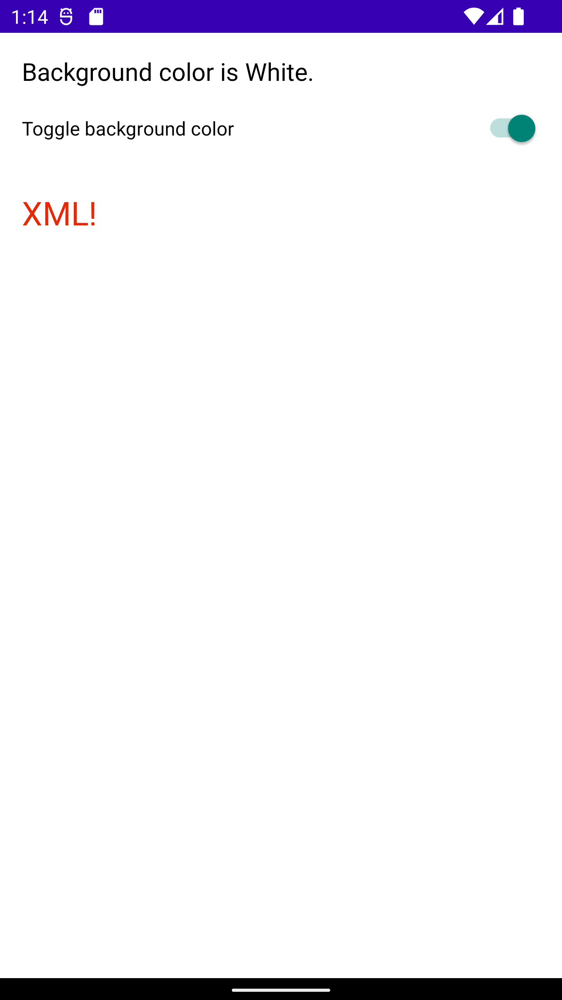

# Description
A simple app that serves either a (1) Compose UI or (2) XML UI based on the A/B test parameter retrieved from Firebase.

# Why did I build this?
I want to play around with Firebase Remote Config and A/B testing. Also I wanted to figure out how to serve different UIs (XML or Compose) that's configurable at runtime.

# Compose UI
Here's what the UI looks like with compose. The switch will toggle between light and dark theme. I basically added this just to illustrate a state change.
| Compose Light  | Compose Dark|
| ------------- | ------------- |
|  |   |

# XML UI
Here's what the UI looks like with xml. The switch will toggle between light and dark theme. I basically added this just to illustrate a state change.
| XML Light  | XML Dark|
| ------------- | ------------- |
|  |   |
